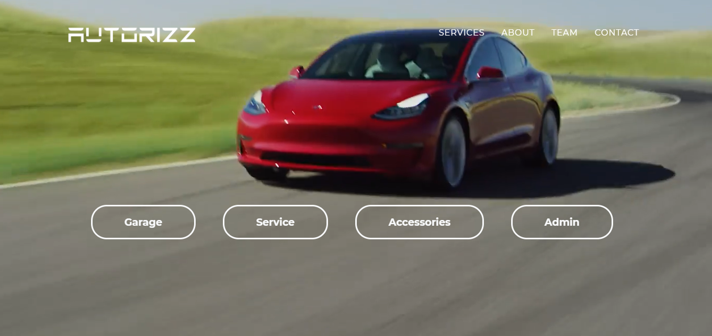
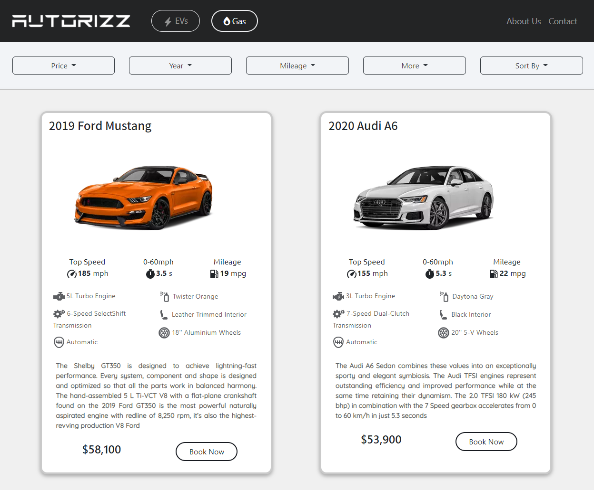
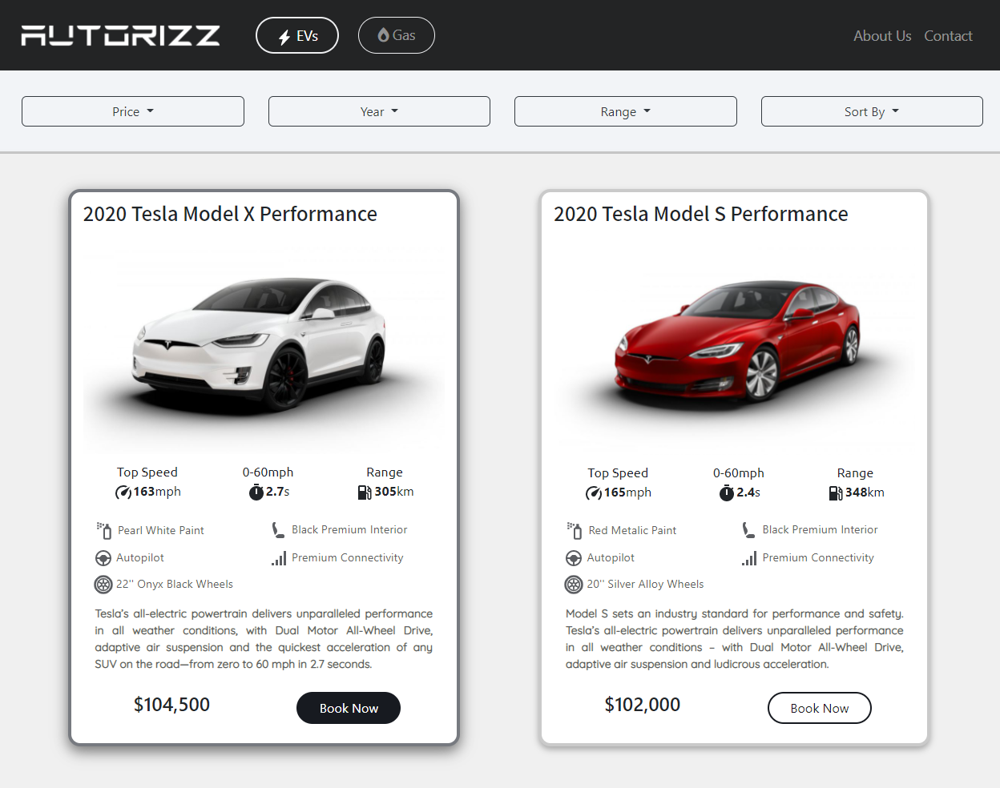
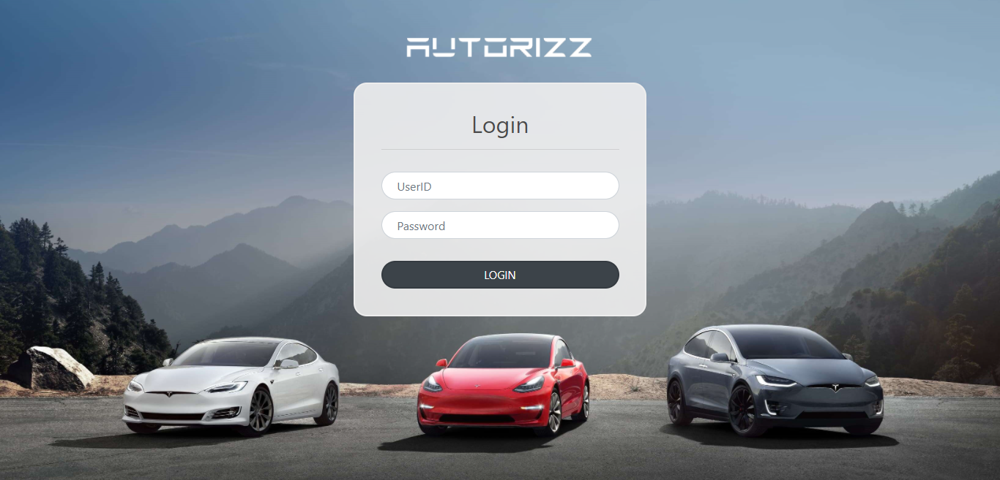

# Car Buying Website

Welcome to the Car Buying Website project! This is a simple web application built using Handlebars.js (HBS) and MongoDB. It allows users to browse and purchase cars online.

## Setup Instructions

1. **Clone the Repository:**
   Clone this repository to your local machine using the following command:

2. **Set Up MongoDB:**
- Install MongoDB on your machine if you haven't already.
- Open MongoDB Compass and create a new database. Note down the name of the database.
- Import the database file provided with the project into your newly created database.

3. **Update Database Connection:**
- Open `app.js` file in the project directory.
- Find the line where the MongoDB connection is established.
- Update the database name in the connection URL to match the name of the database you created in MongoDB Compass.

4. **Install Node Modules:**
Navigate to the project directory in your terminal and run the following command to install the required dependencies:

5. **Run the Application:**
Once the dependencies are installed, you can start the application by running the following command:
The application will start running, and you can access it at `http://localhost:5000` in your web browser.

## Project Structure

- `views/`: Contains all the Handlebars.js (HBS) templates for rendering HTML pages.
- `public/`: Includes static files like CSS, JavaScript, and images.
- `models/`: Contains MongoDB schema and models.
- `routes/`: Contains route handlers for different URLs.
- `app.js`: Main entry point of the application where server setup and routes are defined.

## Dependencies

- express: Web application framework for Node.js.
- mongoose: MongoDB object modeling tool designed to work in an asynchronous environment.
- handlebars: A popular templating engine for building dynamic web pages.

##Screenshots

## Contributing

If you'd like to contribute to this project, feel free to fork the repository, make your changes, and submit a pull request. We welcome any contributions or suggestions for improvement.

Happy coding!
